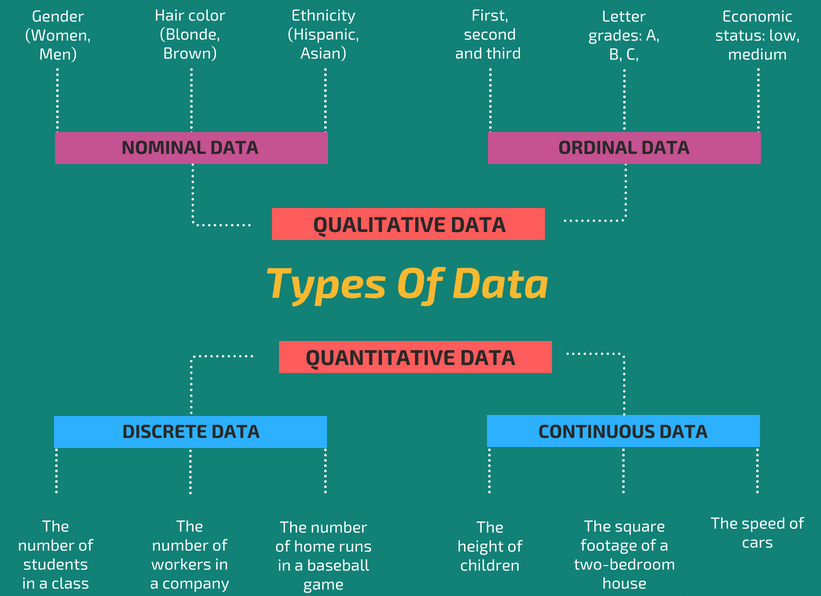

```{r child = "setup.Rmd"}
```

```{r packages, echo=FALSE, message=FALSE, warning=FALSE}
library(tidyverse)
library(magick)
library(knitr)
library(icons)
library(ggsci)
```

class: top

## Workshop guidelines

- **Workshop will be recorded.** We will make our best effort to respect the privacy of participants. Chat will not be recorded. 

.pull-left[
- **Help** is always available.
  - Use the Zoom chat (private or public) to ask a question.
  - Raise your hand `r emo::ji('raised_back_of_hand')`.
  - And you can always un-mute and ask.
]

.pull-right[
<blockquote>
Help will always be given at Hogwarts to those who ask for it.
.right[-- <cite>Albus Dumbledore</cite>]
</blockquote>
]

---

class: middle

# Data visualization

---

## Data visualization

> *"The simple graph has brought more information to the data analyst’s mind than any other device." — John Tukey*

Data visualization is the creation and study of the visual representation of data.

---
class: left, middle

## What makes a good data visualization?

--

It has a **clear** purpose and message

--

It is **easy** to interpret

> A good figure is like a joke; if you have to explain it, it's not that good.

--

It **accurately** reflects the data 

---
class: center, middle

## So what makes a <b style="color:darkred;">BAD </b>data visualization?

---
class: center, top

```{r echo=FALSE, out.width="65%", fig.align = "center"}


```

.footnote[
Source: [https://twitter.com/DanaDanger/status/230851016344600576/photo/1/large](https://twitter.com/DanaDanger/status/230851016344600576/photo/1/large)
]

---
class: center, top

```{r echo=FALSE, out.width="75%", fig.align = "center"}


```

.footnote[
Source: [https://www.vislies.org/2021/gallery/](https://www.vislies.org/2021/gallery/)
]
---
class: center, top 

```{r echo=FALSE, out.width="80%", fig.align = "center"}


```

.footnote[
Source: [Georgia Department of Public Health](https://drive.google.com/file/d/1iM1LGxGqi9OBJp8pqYCtVFbLEPmwuGWJ/view)
]

---
class: center, top 

.pull-left[
```{r echo=FALSE, out.width="100%", fig.align = "center"}


```
]

.pull-right[.footnote[
Source: [https://www.visualcapitalist.com/history-of-pandemics-deadliest/](https://www.visualcapitalist.com/history-of-pandemics-deadliest/)
]]

---
class: middle, center

## Understanding your data

```{r echo = FALSE, out.width = "70%", warnings = FALSE, message = FALSE}

```

.small[.footnote[ 
Source: [https://www.intellspot.com/data-types/](https://www.intellspot.com/data-types/)
]]
---
## Choosing an effective encoding

```{r echo=FALSE, out.width="65%",fig.align="center"}
magick::image_read_pdf("img/channels.pdf",
                       pages = 1)
```

.footnote[ 
Source: [T. Munzner, Visualization Analysis and Design](https://www.cs.ubc.ca/~tmm/vadbook/eamonn-figs/fig5.6.pdf)
]

---
class: middle, inverse

# Choosing the most effective visualization type

---
class: top 

## Choosing an effective visualization type

---
class: top

## Choosing an effective visualization type

What are you trying to **highlight** in your data?

---
class: top 

## Choosing an effective visualization type

What are you trying to **highlight** in your data?

Are you trying to show a variable’s overall pattern of variation or differences among individual values?

---
class: top 

## Choosing an effective visualization type

What are you trying to **highlight** in your data?

Are you trying to show a variable’s overall pattern of variation or differences among individual values?

.pull-left[
### Individual differences 
```{r echo = FALSE, out.width="90%"}

```
]

.pull-right[
### Overall variation
```{r echo = FALSE, out.width="90%"}

```
]

.small[Source: [https://www.perceptualedge.com/articles/visual_business_intelligence/the_visual_perception_of_variation.pdf](https://www.perceptualedge.com/articles/visual_business_intelligence/the_visual_perception_of_variation.pdf)]

---
class: middle

```{r echo=FALSE, out.width = "85%", fig.height = 6, fig.width = 10, fig.align="center", warning=FALSE, message=FALSE}
pokemon <- read_csv("data/pokemon.csv")
pokemon <- pokemon %>% mutate(generation = as.factor(generation),
                              is_legendary = as.factor(is_legendary),
                              is_legendary = case_when(
                                is_legendary == 1 ~ "Legendary",
                                is_legendary == 0 ~ "Regular"
                              ))
ggplot(
  data = pokemon,
  mapping = aes(
    x = attack,
    y = defense,
    color = type1,
    shape = is_legendary,
    size = hp 
  )
) +
  geom_point() +
  labs(
    title = "Pokemon attributes",
    x = "Attack Rating",
    y = "Defense Rating",
    color = "Type",
    shape = "Legend",
    size = "Health Points"
  ) +
  guides(color = guide_legend(nrow = 6, byrow = T)) +
  guides(size = guide_legend(nrow = 2, byrow = T)) +
  guides(shape = guide_legend(nrow = 2, byrow = T)) +
  theme_classic() +
  theme(
    axis.title.x = element_text(size = 16),
    axis.title.y = element_text(size = 16),
    plot.title = element_text(size = 20),
    legend.title = element_text(size = 16)
  )

```

---
class: middle

```{r echo=FALSE, out.width = "85%", fig.height = 6, fig.width = 10, fig.align="center", warning=FALSE, message=FALSE}

ggplot(
  data = pokemon,
  mapping = aes(
    x = attack,
    y = defense,
    color = is_legendary,
  )
) +
  geom_point(size = 4,
             alpha = 0.7) +
  labs(
    title = "Pokemon attributes",
    x = "Attack Rating",
    y = "Defense Rating",
    color = "Legendary"
  ) +
  scale_color_manual(values = c("red", "lightgray")) +
  guides(color = guide_legend(nrow = 5, byrow = T)) +
  guides(size = guide_legend(nrow = 2, byrow = T)) +
  guides(shape = guide_legend(nrow = 2, byrow = T)) +
  theme_classic() +
  theme(
    axis.title.x = element_text(size = 16),
    axis.title.y = element_text(size = 16),
    plot.title = element_text(size = 20),
    legend.title = element_text(size = 16)
  )

```

---
class: middle

```{r echo=FALSE, out.width = "85%", fig.align="center", warning=FALSE, message=FALSE}

ggplot(
  data = pokemon,
  mapping = aes(
    x = attack,
    y = defense
  )
) +
  geom_hex() +
  labs(
    title = "Pokemon attributes",
    x = "Attack Rating",
    y = "Defense Rating",
  ) +
  theme_classic() +
  theme(
    axis.title.x = element_text(size = 16),
    axis.title.y = element_text(size = 16),
    plot.title = element_text(size = 20),
    legend.title = element_text(size = 16)
  )

```

---
class: middle

```{r echo=FALSE, out.width = "65%", fig.align="center", warning=FALSE, message=FALSE}

ggplot(
  data = pokemon,
  mapping = aes(
    x = generation,
    y = hp 
  )) +
  geom_col() +
  scale_fill_npg() +
  labs(
    title = "Pokemon attributes",
    x = "Generation",
    y = "Health Points"
  ) +
   theme_minimal() + 
   theme(panel.grid.major.y = element_blank(),
         panel.grid.minor.y = element_blank())

```

---
class: inverse, middle

# Visualizing Quantities

```{css, echo=F}
    /* Table width = 100% max-width */

    .remark-slide table{
        width: 80%;
    }

    /* Change the background color to white for shaded rows (even rows) */

    .remark-slide thead, .remark-slide tr:nth-child(2n) {
        background-color: white;
    }
```
---
class: middle

## Bar plots

Show how a quantity varies with a categorical variable

--

```{r echo=FALSE} 

boxoffice <- data.frame(rank = 1:5,
                        title = c("Star Wars: The Last Jedi", "Jumanji: Welcome to the Jungle", "Pitch Perfect 3", "The Greatest Showman", "Ferdinand"),
                        title_short = c("Star Wars", "Jumanji", "Pitch Perfect 3", "Greatest Showman", "Ferdinand"),
                        amount = c(71565498, 36169328, 19928525, 8805843, 7316746),
                        amount_text = c("$71,565,498", "$36,169,328", "$19,928,525", "$8,805,843", "$7,316,746"))

boxoffice_display <- select(boxoffice, rank, title, amount_text)
colnames(boxoffice_display) <- c("Rank", "Movie Title", "Amount")
knitr::kable(
  boxoffice_display,
  caption = 'Highest grossing movies for the weekend of December 22-24, 2017. Data source: Box Office Mojo (http://www.boxofficemojo.com/). Used with permission', booktabs = TRUE,
  row.names = FALSE,
  align = c('c', 'c', 'l', 'r', 'c', 'c')#,
  #format = "html",
  #table.attr = "style = \"width: 75%\""
)
```
---
class: middle, center

## Bar plot

```{r echo=FALSE, out.width="70%", fig.width = 8, fig.height = 3, echo = FALSE, message = FALSE}
boxoffice %>%
  ggplot(aes(x = fct_reorder(title_short, rank), y = amount)) +
    geom_col(fill = "#015382", width = 0.6, alpha = 0.9) +
    scale_y_continuous(expand = c(0, 0),
                       breaks = c(0, 2e7, 4e7, 6e7),
                       labels = c("0", "20", "40", "60"),
                       name = "weekend gross (million USD)") +
    scale_x_discrete(name = NULL,
                     expand = c(0, 0.2)) +
    coord_cartesian(clip = "off") +
   theme_minimal() + 
   theme(panel.grid.major.x = element_blank(),
         panel.grid.minor.x = element_blank(),
         axis.text = element_text(size = 14),
         axis.text.y = element_text(size = 16)
    )
```
---
class: middle, center

## Bar plot

What <b style="color:darkred;">not</b> to do:

```{r echo=FALSE, out.width="65%", echo = FALSE, message = FALSE}
boxoffice %>%
  ggplot(aes(x = fct_reorder(title_short, rank), y = amount)) +
    geom_col(fill = "#015382", alpha = 0.9) +
    scale_y_continuous(expand = c(0, 0),
                       breaks = c(0, 2e7, 4e7, 6e7),
                       labels = c("0", "20", "40", "60"),
                       name = "weekend gross (million USD)") +
    scale_x_discrete(name = NULL) +
    coord_cartesian(clip = "off") +
    theme_minimal() +
    theme(
      axis.line.x = element_blank(),
      axis.ticks.x = element_blank(),
      panel.grid.major.x = element_blank(),
      panel.grid.minor.x = element_blank(),
      axis.text.x = element_text(size = 10, angle = 45, vjust = 1, hjust = 1),
      plot.margin = margin(3, 7, 3, 1.5))
```

---
class: middle, center

## Rotated bar plots

```{r echo = FALSE, out.width = "65%", warnings = FALSE, message = FALSE}
boxoffice %>%
  ggplot(aes(y = fct_reorder(title_short, -rank), x = amount)) +
    geom_col(fill = "#015382", alpha = 0.9) +
    scale_x_continuous(expand = c(0, 0),
                       breaks = c(0, 2e7, 4e7, 6e7),
                       labels = c("0", "20", "40", "60"),
                       name = "Weekend Gross (Million USD)") +
    scale_y_discrete(name = NULL) +
    coord_cartesian(clip = "off") +
    theme_minimal() +
    theme(
      axis.ticks.x = element_blank(),
      axis.text = element_text(size = 10),
      panel.grid.major.y = element_blank(),
      plot.margin = margin(3, 7, 3, 1.5))
```
---
class: middle, left

## Ordering bars
Order bars by **ascending** or **descending** order *when* there is no natural ordering to the categories the bars represent

.center[
```{r echo = FALSE, out.width = "65%", warnings = FALSE, message = FALSE}
ggplot(boxoffice, aes(x = factor(title_short, levels = title_short[c(2, 1, 5, 3, 4)]),
                           y = amount)) +
  geom_col(fill = "#015382", alpha = 0.9) +
  scale_y_continuous(limits = c(0, 7.5e7),
                     expand = c(0, 0),
                     breaks = c(0, 2e7, 4e7, 6e7),
                     labels = c("0", "20", "40", "60"),
                     name = "weekend gross (million USD)") +
  scale_x_discrete(name = NULL,
                   expand = c(0, 0.5)) +
  coord_flip(clip = "off") +
  theme_minimal() + 
  theme(
    axis.text = element_text(size = 10),
    panel.grid.major.y = element_blank(),
    axis.line.y = element_blank(),
    axis.ticks.y = element_blank()
  )
```
]

---
class: middle, left

## Ordering bars
Order bars by **ascending** or **descending** order *when* there is no natural ordering to the categories the bars represent

.center[
```{r echo = FALSE, out.width = "65%", warnings = FALSE, message = FALSE}
boxoffice %>%
  ggplot(aes(y = fct_reorder(title_short, -rank), x = amount)) +
    geom_col(fill = "#015382", alpha = 0.9) +
    scale_x_continuous(expand = c(0, 0),
                       breaks = c(0, 2e7, 4e7, 6e7),
                       labels = c("0", "20", "40", "60"),
                       name = "Weekend Gross (Million USD)") +
    scale_y_discrete(name = NULL) +
    coord_cartesian(clip = "off") +
    theme_minimal() +
    theme(
      axis.ticks.x = element_blank(),
      axis.text = element_text(size = 10),
      panel.grid.major.y = element_blank(),
      plot.margin = margin(3, 7, 3, 1.5))
```
]

---
class: center, left 

## Visualizing multiple categorical variables

<br>
```{r out.width = "50%", echo=FALSE} 
cookie_df <- data.frame(
  Cookie = c(
    "Chocolate Chip",
    "Sugar",
    "Oatmeal",
    "Peanut Butter",
    "Gingersnap"
  ),
  Raw = c(7, 28, 19, 23, 10),
  Burnt = c(15, 18, 13, 14, 19),
  Chewy = c(20, 17, 12, 9, 2),
  Round = c(4, 8 , 12, 17, 24),
  Intact = c(12, 14, 19, 18, 31)
)

knitr::kable(cookie_df, format = 'html')

cookie_df <- gather(cookie_df,
                    key = "Attributes",
                    value = "Count", 2:6)
```

---
class: middle

## Grouped bar plots

Comparisons **across** individuals

```{r out.width="90%", fig.width = 8, echo=FALSE, message=FALSE}

 ggplot(data = cookie_df, 
        mapping = aes(x = Cookie, y = Count, fill = Attributes)) +
   geom_bar(stat = "identity", position = "dodge") +
   scale_fill_npg() +
   labs(title = "Attributes by cookie", ylab = NULL) + 
   theme_minimal() + 
   theme(panel.grid.major.x = element_blank(),
         panel.grid.minor.x = element_blank())
```

---
class: middle

## Grouped bar plots

Comparisons **across** categories 

```{r out.width="90%", fig.width = 8, echo=FALSE, message=FALSE}

 ggplot(data = cookie_df, 
        mapping = aes(x = Attributes, y = Count, fill = Cookie)) +
   geom_bar(stat = "identity", position = "dodge") +
   scale_fill_npg() +
   labs(title = "Cookies by attribute", ylab = NULL) + 
   theme_minimal() + 
   theme(panel.grid.major.x = element_blank(),
         panel.grid.minor.x = element_blank())
```
---
class: middle

## Stacked bar plots

Distribution of attributes **within** individuals

---
class: left, middle 

### Stacking can be used when:

The **sum of the individual stacked bars is a meaningful amount** (total cookies per cookie type) or

The **individual bars represent counts** (number of cookies)

```{r out.width="90%", fig.width = 8, echo=FALSE, message=FALSE}

 ggplot(data = cookie_df, 
        mapping = aes(x = Count, y = Cookie, fill = Attributes)) +
   geom_bar(stat = "identity") +
   scale_fill_npg() +
   labs(title = "Distribution of attributes by cookie", ylab = NULL) + 
   theme_minimal() + 
   theme(panel.grid.major.y = element_blank(),
         panel.grid.minor.y = element_blank())
```

---
class: middle

## Grouped barcharts

Comparisons **within** attributes

```{r out.width="90%", fig.width = 8, echo=FALSE, message=FALSE}
 ggplot(data = cookie_df, 
        mapping = aes(x = Count, y = Cookie, fill = Attributes)) +
   geom_bar(stat = "identity", position = "dodge") +
   scale_fill_npg() +
   facet_wrap(~ Attributes, nrow = 1) +
   labs(title = "Stacked bars", ylab = NULL) + 
   theme_minimal() + 
   theme(panel.grid.major.y = element_blank(),
         panel.grid.minor.y = element_blank(),
         legend.position = "bottom")
```

---
class: middle

## Percent Stacked barcharts

Distribution **aross** individuals

```{r out.width="90%", fig.width = 8, echo=FALSE, message=FALSE}

 ggplot(data = cookie_df, 
        mapping = aes(x = Count, y = Cookie, fill = Attributes)) +
   geom_bar(stat = "identity", position = "fill") +
   scale_fill_npg() +
   labs(title = "Stacked bars", ylab = NULL) + 
   theme_minimal() + 
   theme(panel.grid.major.y = element_blank(),
         panel.grid.minor.y = element_blank(),
         legend.position = "bottom")
```


---
class: inverse, middle
# Visualizing Distributions

---
class: inverse, middle

# Visualizing Proportions

---
class: middle

# Visualizing Multivariate Data 

## Think small (multiples)

---
class: middle

# Questions?

.footnote[
Please complete the survey for this workshop:<br> [bit.ly/ggplot2-survey](bit.ly/ggplot2-survey)
]
---